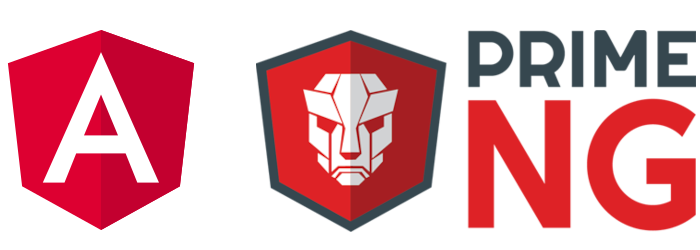

&nbsp;&nbsp;&nbsp;&nbsp;&nbsp;&nbsp;

# Índice de aplicaciones de Angular - Curso 2021 / 2022

## 1er TRIMESTRE

[Enunciado con los requisitos de la aplicación](trabajo_angular_v2.pdf)

## 2o TRIMESTRE

En el segundo trimestre, para todos los alumnos, tanto duales como no duales, es obligatorio entregar una aplicación realizada en Angular que cumpla todos los requisitos que se pedían para la del primer trimestre además de los siguientes:
* Almacenamiento de datos en Firebase

La autenticación de usuarios con Firebase no es obligatoria, se deja como característica opcional.

### 🗓️ Plazos de entrega

* **Jueves 10 de marzo a las 23:59**: Límite para las actualizaciones del repositorio de la aplicación. 
* **Viernes 11 de marzo**: Presentación por estricto orden de lista. Para los alumnos no duales, la presentación se hará de forma conjunta con la aplicación de Ionic (asignatura AD)

### :iphone: Índice a las aplicaciones

* De Abrisqueta Rangel, Ander - [Pulserástica](https://github.com/AnderDeAbrisqueta/pulserastica)
* Buendía López, Jairo - [DragonBallWiki](https://github.com/jairobuendia/DragonBallWiki)
* Egea Hermoso, Adrián - [FilmHome](https://github.com/AdrianEgeaHermoso/FilmHome_Angular)
* Estrada Cobo, Jose Manuel - [Task-List](https://github.com/JoseEstradaC/task-list)
* Rodriguez Barbero Verdera, David - [MattersAccounting](https://github.com/Davidrbv/MatterAccounting)
* Fabián El Belaizi, Daniel - [Colección de animales](https://github.com/Danny-06/Coleccion-de-animales-domesticos-angular-v2)
* Sevilla Valderrama, Fernando Iván - [LolApiRes](https://github.com/FESEVA/angular-lolApiRes)
* Millán Rebollo, Noel - [Femore](https://github.com/NoelMillan/angular-project)
* Moreno Rodríguez, Javier - [Nature](https://github.com/Javiemr/AngularProjecto)

:star: Si te ha gustado este repo, dale una estrellita :wink:
